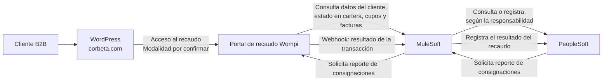

# Cómo podrían conectarse los sistemas
- Actualizado: el 2026-09-18 01:27
- Rol de ejecución: arquitecto de soluciones de recaudo, especialista financiero de cartera y tesorería, y arquitecto de integraciones MuleSoft–PeopleSoft
- Autor: Sam (Asistente IA del Sr. Wolfan)

## 1. Objetivo y alcance

**Objetivo.** Mostrar, de forma preliminar, cómo podrían conectarse los sistemas al relacionar las capacidades funcionales del negocio con los contratos técnicos de Wompi y las responsabilidades de integración que podrían atender MuleSoft y PeopleSoft.

**Alcance.** Las APIs son responsabilidades lógicas propuestas; este documento no fija su número ni su diseño definitivo. Al revisar el inventario de MuleSoft y las conexiones con PeopleSoft, una responsabilidad puede dividirse en varias APIs o varias responsabilidades pueden mantenerse en una sola operación coherente.

## 2. Flujo esperado de información

El flujo esperado es el siguiente:

1. El cliente entra por `corbeta.com`.
2. WordPress lo lleva al portal de recaudo de Wompi.
3. Wompi maneja el inicio de sesión del cliente con su propio correo, contraseña y OTP, mientras Corbeta no adopte SSO.
4. Cuando Wompi necesita consultar facturas, usa la `api_key` que Corbeta le entregó y llama a MuleSoft.
5. MuleSoft valida la llave y consulta PeopleSoft.
6. Cuando el cliente paga, Wompi notifica el resultado a MuleSoft mediante un webhook.
7. MuleSoft valida la firma del webhook y entrega el resultado a PeopleSoft.
8. Para solicitar el reporte de consignaciones, Wompi debe informar qué API expone y cómo MuleSoft se autentica ante ella.

## 3. Responsabilidades de los sistemas

### Sistemas que participan en el flujo

| Sistema | Responsabilidad en el flujo esperado |
| --- | --- |
| WordPress (`corbeta.com`) | Presentar `corbeta.com` como punto de entrada y dirigir al cliente al portal de recaudo de Wompi. La forma de acceso queda por confirmar. |
| Wompi | Presentar el portal de recaudo, procesar el pago e intercambiar la información necesaria con MuleSoft. |
| MuleSoft | Exponer y consumir los servicios de integración necesarios entre Wompi y PeopleSoft. |
| PeopleSoft | Consultar la información de cartera y tratar internamente el resultado del recaudo. |

### Identificación utilizada

| Identificador | Significado | Ejemplo |
| --- | --- | --- |
| API | Responsabilidad atendida mediante un servicio de consulta o registro. | API-04: consultar todas las facturas pendientes de pago. |
| INT | Integración complementaria que conecta sistemas o procesos, sin representar una API principal. | — |
| DEP | Responsabilidad interna de Corbeta que ocurre después de la interacción con Wompi. | DEP01: registrar el resultado del recaudo en PeopleSoft. |

### WordPress (`corbeta.com`)

| Capacidad | Qué hace | Relación con otros sistemas | Pendiente de confirmar |
| --- | --- | --- | --- |
| Acceder al recaudo | Recibe al cliente como punto de entrada y lo dirige al portal de Wompi. | `Cliente → WordPress (corbeta.com) → Wompi` | Si el acceso se resuelve mediante redirección, Wompi embebido en la landing page o SSO. |

### Wompi

#### Contratos técnicos de Wompi

| # | Contrato | Para qué sirve | Capacidades relacionadas | Fuente |
| --- | --- | --- | --- | --- |
| 1 | Recaudo estándar por API | Permite que Wompi consulte en Corbeta los documentos de cobro asociados a una referencia y reciba sus fechas, referencias y valores. No ejecuta el pago. | CF06; aporta la información que Wompi usa en CF07–CF10. | [Recaudo estándar por API.md](<../../../../Insumos/Proveedores de Servicio/Wompi/03_Documentacion_Tecnica/Recaudo estándar por API.md>) |
| 2 | Webhook transaccional | Envía a Corbeta el resultado de una transacción realizada en Wompi. | CF16 | [Webhook transaccional.md](<../../../../Insumos/Proveedores de Servicio/Wompi/03_Documentacion_Tecnica/Webhook transaccional.md>) |
| 3 | Single Sign-On | Permite evaluar un inicio de sesión integrado entre Wompi y Corbeta. | CF02 | [Single Sign-On.md](<../../../../Insumos/Proveedores de Servicio/Wompi/03_Documentacion_Tecnica/Single Sign-On.md>) |

#### Seguridad de las conexiones

| Conexión | Cómo se acredita la conexión | Qué permite |
| --- | --- | --- |
| Wompi → MuleSoft | Corbeta entrega una `api_key` a Wompi. Wompi la envía como `Bearer` en cada consulta de documentos. Para el webhook, MuleSoft valida la firma, el secreto y el timestamp de cada evento. | La `api_key` permite consultar documentos de cobro. La firma permite aceptar el resultado de un pago. Ninguno autoriza otros servicios de Corbeta. |
| MuleSoft → Wompi | Wompi debe entregar la credencial que MuleSoft usará para solicitar el reporte de consignaciones y definir su vigencia y renovación. | Solicitar el reporte de consignaciones. |
| Corbeta → Wompi | Si Corbeta adopta SSO, Wompi recibe `client_id`, `client_secret` y la sesión del cliente, y devuelve un token de sesión. | Crear la sesión del cliente en Wompi. |

#### Capacidades atendidas principalmente por Wompi

| # | ID | Capacidad | Razón arquitectónica |
| --- | --- | --- | --- |
| 1 | CF02 | Iniciar sesión de forma segura | Wompi gestiona el acceso; la variante SSO solo participa si Corbeta la adopta. |
| 2 | CF03 | Restablecer la contraseña | Wompi gestiona el correo y el código OTP. |
| 3 | CF07 | Buscar y filtrar facturas | Wompi realiza la búsqueda y los filtros sobre la lista recibida de API-04. |
| 4 | CF08 | Seleccionar una o varias facturas | Es una interacción del usuario dentro del portal de Wompi. |
| 5 | CF09 | Abonar una parte de una factura | Wompi permite seleccionar la factura, indicar un importe parcial y realizar el pago dentro del portal. |
| 6 | CF10 | Consultar el valor final y el detalle del pago | Wompi presenta el valor total o parcial con la información vigente de las facturas. |
| 7 | CF11 | Pagar un anticipo sin factura | Wompi permite al cliente ingresar un valor sin seleccionar una factura pendiente. |
| 8 | CF12 | Pagar por un medio habilitado | Wompi procesa el pago con las redes financieras. |
| 9 | CF13 | Consultar pagos realizados | Wompi presenta el histórico y los comprobantes de su plataforma. |
| 10 | CF14 | Consultar intentos de pago | Wompi presenta los estados, rechazos y reintentos. |
| 11 | CF15 | Informar al cliente el resultado | Wompi muestra o envía al cliente el resultado del pago. |
| 12 | CF17 | Consultar consignaciones en pantalla | El equipo de Corbeta consulta esta información en el portal administrativo de Wompi. |

### MuleSoft

#### Capacidades atendidas por MuleSoft y Wompi

| # | ID | Capacidad Wompi | Dirección | Contrato | Servicio en MuleSoft |
| --- | --- | --- | --- | --- | --- |
| 1 | CF01 | Registrar clientes en el portal de Wompi | Wompi → MuleSoft | Por definir | `API-01` — Consultar identificación, correo y teléfono del cliente en Corbeta |
| 2 | CF04 | Consultar el estado del cliente en la cartera de Corbeta | Wompi → MuleSoft | Por definir | `API-02` — Consultar si el cliente está activo en la cartera |
| 3 | CF05 | Consultar los cupos de crédito | Wompi → MuleSoft | Por definir | `API-03` — Consultar cupo asignado, utilizado y disponible |
| 4 | CF06 | Consultar las facturas pendientes | Wompi → MuleSoft | Recaudo estándar por API | `API-04` — Consultar todas las facturas pendientes de pago del cliente |
| 5 | CF16 | Enviar el resultado de la transacción | Wompi → MuleSoft | Webhook | `API-05` — Recibir el resultado de la transacción |
| 6 | CF18 | Solicitar el reporte de consignaciones | MuleSoft → Wompi | Por definir | `API-06` — Solicitar el reporte de consignaciones a Wompi |
| 7 | CF02 | Iniciar sesión de forma segura | MuleSoft → Wompi | API SSO de Wompi | No aplica; MuleSoft consume la API SSO de Wompi |

#### Alcance de los servicios en MuleSoft

| Servicio en MuleSoft | Aclaración de alcance |
| --- | --- |
| `API-01` — Consultar identificación, correo y teléfono del cliente en Corbeta | Entrega datos de un cliente existente. No crea clientes en Corbeta ni usuarios en el portal de Wompi. |
| `API-02` — Consultar si el cliente está activo en la cartera | Informa la condición definida por Cartera. No controla el acceso al portal ni reemplaza la consulta de cupos. |
| `API-03` — Consultar cupo asignado, utilizado y disponible | Informa los cupos del cliente. No determina si el cliente está activo en la cartera. |
| `API-04` — Consultar todas las facturas pendientes de pago del cliente | Entrega las facturas disponibles para pago. Wompi define si el cliente paga el total o un importe parcial. |
| `API-05` — Recibir el resultado de la transacción | Recibe el aviso de Wompi y lo entrega a Corbeta para su tratamiento interno. |
| `API-06` — Solicitar el reporte de consignaciones a Wompi | Solicita el reporte cuando Corbeta lo requiere. |

### PeopleSoft

#### Capacidades atendidas por PeopleSoft y MuleSoft

| # | MuleSoft | Dirección | PeopleSoft |
| --- | --- | --- | --- |
| 1 | `API-01` — Consultar identificación, correo y teléfono del cliente en Corbeta | MuleSoft → PeopleSoft | Consultar datos del cliente |
| 2 | `API-02` — Consultar si el cliente está activo en la cartera | MuleSoft → PeopleSoft | Consultar estado en cartera |
| 3 | `API-03` — Consultar cupo asignado, utilizado y disponible | MuleSoft → PeopleSoft | Consultar cupos de crédito |
| 4 | `API-04` — Consultar todas las facturas pendientes de pago del cliente | MuleSoft → PeopleSoft | Consultar facturas pendientes |
| 5 | `API-05` — Recibir el resultado de la transacción | MuleSoft → PeopleSoft | Registrar el resultado del recaudo |
| 6 | `API-06` — Solicitar reporte de consignaciones a Wompi | PeopleSoft → MuleSoft | Solicitar reporte de consignaciones |
