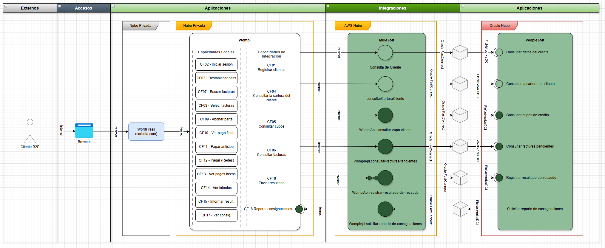

# Modelo de Integración Propuesto

- Actualizado: el 2026-09-21 23:20
- Rol de ejecución: arquitectura de soluciones e integraciones y análisis de inventarios
- Autor: Sam (Asistente IA del Sr. Wolfan)

## Resultado de la propuesta

El modelo habilita el recaudo de clientes empresariales desde `corbeta.com`. El cliente accede al portal de Wompi, Wompi consume las interfaces expuestas por MuleSoft y MuleSoft se integra con PeopleSoft. No existe una conexión directa entre Wompi y PeopleSoft.

La propuesta contiene seis interfaces en MuleSoft: dos candidatas existentes seleccionadas en LeanIX y cuatro interfaces nuevas. Los contratos técnicos aún deben validarse antes de la construcción.

## Diagrama del modelo

El archivo editable y fuente de verdad visual es [Diagrama.drawio](../../design/Diagrama.drawio).

## Lectura del modelo

| Elemento | Responsabilidad representada |
| --- | --- |
| Cliente B2B | Ingresar al proceso de recaudo y realizar el pago. |
| Browser | Permitir el acceso del cliente a `corbeta.com`. |
| WordPress (`corbeta.com`) | Presentar el botón **Realizar pago** y redirigir al cliente a Wompi. |
| Wompi | Presentar la experiencia de recaudo, procesar el pago y enviar su resultado. |
| MuleSoft | Exponer las interfaces para Wompi, recibir el webhook y orquestar las conexiones con PeopleSoft. |
| PeopleSoft | Entregar la información financiera requerida y tratar el resultado del recaudo. |

Las conexiones entre Wompi y MuleSoft se representan por Internet. Entre MuleSoft y PeopleSoft, el diagrama muestra Oracle FastConnect y FlowNetworks DCI. La arquitectura detallada debe confirmar el recorrido técnico y los contratos utilizados en cada conexión.

## Interfaces del modelo

| # | Interfaz en MuleSoft | Dirección | Responsabilidad | Referencia y condición |
| --- | --- | --- | --- | --- |
| 1 | `Consulta de Cliente` | Wompi → MuleSoft → PeopleSoft | Consultar identificación, correo y teléfono del cliente. | `IBUS0004` — Candidata existente por validar. |
| 2 | `consultarCarteraCliente` | Wompi → MuleSoft → PeopleSoft | Consultar la información de cartera requerida para el recaudo. | `IBUS0187` — Candidata existente por validar. |
| 3 | `WompiApi.consultar-cupo-cliente` | Wompi → MuleSoft → PeopleSoft | Consultar el cupo asignado, utilizado y disponible. | Nueva propuesta. |
| 4 | `WompiApi.consultar-facturas-pendientes` | Wompi → MuleSoft → PeopleSoft | Consultar las facturas pendientes y sus importes vigentes. | Nueva propuesta. |
| 5 | `WompiApi.registrar-resultado-del-recaudo` | Wompi → MuleSoft → PeopleSoft | Recibir el webhook y entregar el resultado del recaudo a PeopleSoft. | Nueva propuesta. |
| 6 | `WompiApi.solicitar-reporte-de-consignaciones` | PeopleSoft → MuleSoft → Wompi | Solicitar y obtener el reporte de consignaciones. | Nueva propuesta; depende de la definición técnica de Wompi. |

Los componentes verde claro representan elementos existentes que requieren modificación. Los componentes verde oscuro representan elementos nuevos.

## Decisiones representadas

### Acceso al recaudo

El cliente ingresa desde el navegador a `corbeta.com` y selecciona **Realizar pago**. WordPress lo redirige al portal de Wompi, donde continúa la experiencia de recaudo.

### Consultas para preparar el pago

Wompi solicita a MuleSoft los datos del cliente, su cartera, sus cupos y sus facturas pendientes. MuleSoft consulta a PeopleSoft y devuelve la información a Wompi.

### Resultado del recaudo

`WompiApi.registrar-resultado-del-recaudo` se expone en MuleSoft. Wompi actúa como cliente HTTP y envía el webhook con el resultado de la transacción.

El símbolo de recepción se ubica en MuleSoft porque allí se expone el puerto que recibe la conexión. MuleSoft valida el evento y entrega el resultado a PeopleSoft para su tratamiento financiero.

### Reporte de consignaciones

PeopleSoft inicia la solicitud del reporte a través de `WompiApi.solicitar-reporte-de-consignaciones`. MuleSoft consume el servicio que Wompi defina para entregar el reporte.

Wompi debe confirmar si dispone de esa API y entregar su contrato, autenticación, vigencia de credenciales y forma de respuesta. Esta definición complementa el recaudo y no bloquea el flujo principal.

## Seguridad y trazabilidad

- Las interfaces expuestas por MuleSoft para Wompi utilizan OAuth 2.0.
- MuleSoft recibe el webhook mediante HTTPS y valida la firma SHA-256 y la vigencia del evento.
- La respuesta 200 OK confirma que MuleSoft recibió el webhook; no confirma que PeopleSoft haya aplicado el recaudo.
- MuleSoft debe conservar el identificador de la transacción, la fecha, el resultado recibido y el estado de entrega hacia PeopleSoft.
- La arquitectura detallada debe definir idempotencia, reintentos, manejo de errores y reproceso controlado.

## Validaciones requeridas

| Definición | Responsable | Criterio de cierre |
| --- | --- | --- |
| Validar contratos, operaciones y permisos de `IBUS0004` e `IBUS0187`. | MuleSoft y PeopleSoft | Confirmar que cada candidata entrega la información requerida. |
| Definir los contratos de las cuatro interfaces `WompiApi`. | MuleSoft, PeopleSoft y Wompi | Acordar operaciones, datos, respuestas, errores y seguridad. |
| Confirmar la API para solicitar el reporte de consignaciones. | Wompi | Recibir el contrato y el mecanismo de autenticación. |
| Definir el manejo del webhook. | MuleSoft y PeopleSoft | Acordar idempotencia, reintentos, trazabilidad y reproceso. |

## Criterio para avanzar

La arquitectura puede continuar hacia el diseño detallado con el modelo propuesto. Antes de construir el flujo principal deben validarse las dos candidatas de LeanIX, definirse los contratos de las interfaces nuevas y acordarse el manejo del webhook.

La confirmación del reporte de consignaciones se gestiona como una definición complementaria con Wompi y no impide continuar con el recaudo principal.

## Fuentes

- [Descripción de la Arquitectura de Solución](../../design/Descripcion_Arquitectura_de_Solucion.md)
- [Evaluación de candidatas en LeanIX](../02_Evaluacion_de_APIs/Evaluacion_Candidatas_LeanIX.md)
- [Candidatas del inventario para el modelo de integración](../02_Evaluacion_de_APIs/Candidatas_Inventario_Mapeo.md)
- [Modelo de Integración Inicial](01_Modelo_Integracion_Inicial.md)
